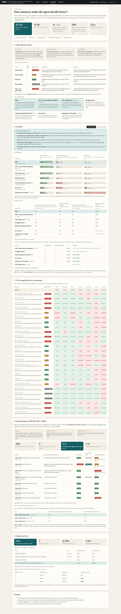

# WHY — state-aware decision memory

**WHY remembers why your organization made each engineering decision, notices when the assumptions behind it stop being true, and changes its recommendation because of what it remembers.**

Architecture decision records capture *what* was decided. They don't notice when the world that justified the decision moves on — and the evidence that it moved on usually lives in other documents, written by other people, years later. WHY keeps decisions, incidents and environment changes in [Hindsight](https://github.com/vectorize-io/hindsight) memory, recovers the implicit assumptions each decision depended on, and checks them against everything that happened since.

```
Q: We're building the customs-duty ledger. Should we use Postgres like the payments ledger did?

RECONSIDER — critical assumptions behind ADR-007 no longer hold.

Then  ADR-007 (2023-02-14, 3 years 7 months ago) · PostgreSQL 14 on RDS, Multi-AZ, us-east-1
Now   BROKEN  write volume stays near the ~1,800/s projection    ← SIG-2025-12: peaked at 3,140/s, 4,500/s projected
      BROKEN  finance reporting runs SQL JOINs on the primary     ← SIG-2025-08: close moved to Snowflake; direct queries disabled
      HOLDS   payment processing runs only in us-east-1           ← SIG-2025-01 confirms ledger stayed in us-east-1
```

Without memory, the same model answers "the expected 1.2k writes per second is within its proven capacity, so you can reuse the same approach."


**How Hindsight memory is used:** [HINDSIGHT.md](HINDSIGHT.md) (retain with real dates, tag-scoped recall per stage, `reflect` as a baseline, and the measured effect of memory).

> Keelwright Freight is a **fictional** company. Its ADRs, postmortems and change notes in `data/` are synthetic, written to read like real engineering records.

## What it does


| | |
|---|---|
| **Ask** | Recall the precedent decision, recall what changed for each of its assumptions, return REUSE / ADAPT / RECONSIDER / INSUFFICIENT_EVIDENCE with cited evidence. |
| **Learn** | Ingest a postmortem or accept a new decision; it is retained and the next answer changes. |
| **Tripwire** | Record a change ("consolidating into eu-central-1"); WHY finds the past decisions whose assumptions it breaks — nobody has to ask. |

## How it works

```
                 ┌──────────── React UI (web/, Vite + TypeScript) ────────────┐
                 │ Ask · Then vs Now · Evidence · Memory trace · Tripwire │
                 └──────────────────────────┬───────────────────────────┘
                                            │ FastAPI (src/app.py)
   ┌────────────────────────────────────────┴────────────────────────────────────────┐
   │ 1 recall precedent (kind:adr) → 2 recall changes per assumption (kind:signal/pm) │
   │ 3 LLM judges each assumption → 4 code grounds citations → 5 rule-based verdict    │
   └──────────┬───────────────────────────────┬────────────────────────────┬──────────┘
        Hindsight Cloud                 SQLite record store             LLM (OpenAI-compatible)
   retain / recall / reflect        canonical records by ID        openai/gpt-oss-120b
   what is relevant, and when       what was actually written      narrow JSON judgements
```

Design rules that keep it auditable:

- **Assumptions are recovered, not hand-written.** ADRs are prose. `src/ingest.py` extracts the premises each decision depends on, and keeps an assumption only if its supporting quote appears verbatim in the source.
- **Only later evidence counts.** Evidence dated before the decision was part of its context and cannot invalidate it.
- **The LLM judges; code decides.** The model labels each assumption HOLDS / BROKEN / UNKNOWN with citations. Code drops citations it was never given, downgrades uncited BROKEN claims, and applies the verdict rules in `src/rules.py`. The rules are monotone: a worse assumption status can never produce a more confident verdict (tested over every combination in `tests/test_rules.py`). This guarantees the rule layer, not the LLM's judgement that feeds it.
- **Fail safe.** If the model's output is invalid after one retry, every assumption becomes UNKNOWN, which yields ADAPT, never REUSE.
- **An UNKNOWN must point at something.** The judge may call an assumption UNKNOWN only when evidence addresses it ambiguously. An UNKNOWN that cites no evidence means nothing in memory addresses it, so it is recorded as *no change recorded*. (A failed or missing judgement is never settled this way, so it stays UNKNOWN.)

See [HINDSIGHT.md](HINDSIGHT.md) for exactly how Hindsight memory is used.

## Quick start

```bash
python -m venv .venv && .venv/Scripts/activate      # macOS/Linux: source .venv/bin/activate
pip install -r requirements.txt
cp .env.example .env                                # add your Hindsight and LLM keys (Cerebras, Groq or any OpenAI-compatible API)
python -m scripts.seed                              # builds the memory bank (~40 s)
cd web && npm install && npm run build && cd ..     # React UI (served by FastAPI from web/dist)
uvicorn src.app:app --port 8000                     # open http://localhost:8000
```

Tests (no network): `python -m pytest -q tests` · UI development with hot reload: `cd web && npm run dev` (proxies the API on :8000)

## Demo

1. Click **Postgres for a new ledger?** — memory ON vs OFF, ADR-007, two broken assumptions, RECONSIDER.
2. Click **Retry policy for a new integration?** — REUSE. Under *New documents*, **Ingest** PM-2024-11. Ask again — RECONSIDER, citing the outage.
3. Under *Record a change*, enter "Consolidating all production into eu-central-1" — tripwire alerts.
4. **Accept & remember** a recommendation — it appears in the memory timeline and supersedes the old decision.

`POST /api/demo/reset` (or `python -m scripts.seed`) restores the starting state.

## Evaluation



**The question we test:** when the reasons behind a past decision have changed, does the agent change its advice, and does it stay quiet when nothing changed? We score the *decision*, not whether the right document was retrieved.

**How the test works** (`python -m evaluation.run_benchmark`):

- **The exam.** 26 questions an engineer at the fictional Keelwright Freight might ask, e.g. *"Should we use Postgres like payments did?"*. The correct verdict for each was written in `evaluation/cases.json` before anything was run.
- **Five kinds of question.** *Stale decision*: a key reason broke, so the answer is reconsider (7 questions). *Partly changed*: adapt (6). *Still valid*: reuse (7). *No precedent* (3). *After a new postmortem*: asked again after a retry-storm postmortem is added mid-test, and the answer must change (3). Six are leading questions ("…like the shipper portal, right?").
- **The contestants.** Seven ways of answering over the same 37-record memory, every LLM contestant on the same model (`gpt-oss-120b` via Cerebras).
- **The marking.** Exact match against the answer key. No LLM grades anything.

| Contestant | What it is | Correct answers | Reused a stale decision ↓ | False alarm ↓ |
|---|---|---|---|---|
| **WHY** | full agent: extracted assumptions, per-assumption recall, date filter, rule-based verdict | **23/26 (88%)** | 1/16 | **0/7** |
| WHY + hand-written assumptions | same agent with human-written assumptions: measures extraction mistakes | 25/26 (96%) | 0/16 | 0/7 |
| WHY, single recall | one question-keyed recall instead of one per assumption: tests two-stage recall | 23/26 (88%) | 0/16 | 0/7 |
| Hindsight `reflect` | Hindsight's built-in reasoning over the same bank (its own model) | 17/26 (65%) | 0/16 | 0/7 |
| Memories pasted into the LLM | top 15 recalled memories in the prompt, no decision structure | 13/26 (50%) | 4/16 | 0/7 |
| No memory | the same LLM, question only | 8/26 (31%) | 4/16 | 1/7 |
| Always says "reconsider" | a dummy: shows why "reused a stale decision" alone can be gamed | 10/26 (39%) | 0/16 | 7/7 |

*Reused a stale decision* = said "reuse" when the right answer was adapt or reconsider (16 such questions). *False alarm* = said "reconsider" when the decision was still valid (7 such questions).

**What the numbers say**

1. **Structured memory beats no memory:** 23/26 vs 8/26 (exact McNemar p = 0.0003). Pasting recalled memories into the model isn't enough either: 13/26 (p = 0.006).
2. **It learns:** asked the same question before and after a retry-storm postmortem is added, WHY gave the right answer both times in 3 of 3 pairs. No memory: 0 of 3.
3. **Hindsight `reflect` is a strong baseline:** 17/26, and it never reused a stale decision. WHY is 6 questions ahead, but with 26 questions that gap is not statistically significant (p = 0.15).
4. **The decision layer does the work, not the retriever:** the single-recall variant ties WHY (23 vs 23).
5. **Where WHY fails:** 3 misses. C05 and C06: it said *reconsider* where *adapt* was right, because extraction rated a minor assumption critical. C20: it said *reuse* where *adapt* was right. All three are answered correctly with hand-written assumptions (25/26 overall), so assumption extraction is the main source of error. Every answer is in the per-question grid on the Evaluation page.

**Tripwire:** we record 5 changes (e.g. "Northline cuts our rate limit to 40 requests/s"). WHY caught 5 of the 6 assumption breakages on the answer key (83% recall); 5 of its 10 alerts were on the key (50% precision).

**Speed and cost** (`python -m evaluation.run_perf`): a median of **3.4 s** from question to verdict, of which 0.9 s is the LLM. One LLM call, ~2,350 tokens and 5.6 Hindsight recalls per question. Hindsight recall takes ~0.45 s and scaled from 1.3 to 10 recalls/s as concurrency rose from 1 to 8, so memory isn't the bottleneck; the free-tier LLM rate limit is.

Full tables: [`evaluation/results/results.md`](evaluation/results/results.md). The Evaluation page in the app shows every question and every contestant's answer.

### Real-data track: GOV.UK's published decisions

Synthetic data can't answer "does this work on decisions someone else wrote?", so WHY is also run on the 38 real architecture decision records GOV.UK published between 2017 and 2022 ([alphagov/govuk-aws](https://github.com/alphagov/govuk-aws), MIT). `python -m scripts.import_govuk && python -m evaluation.run_real` does two things:

1. **Extraction on real prose** — recover grounded assumptions from ADRs written by GOV.UK engineers.
2. **Retrospective** — evaluate decisions as of December 2022 using only *later* ADRs as evidence. Targets are decisions GOV.UK itself later superseded or reversed; controls are decisions its record never revisits. The ground truth is GOV.UK's own history. The "Superseded by" notes later added to old records are stripped on import so the answer cannot leak.

Results (`evaluation/results/real_govuk.md` and `real_govuk_runs.json`):

- **Extraction transfers to real prose:** 109 grounded assumptions from 38 ADRs written by GOV.UK engineers; only 3 rejected because the quote wasn't verbatim. This held in every run.
- **The retrospective is unstable at this size**, so every run is reported:

| Run | Changed decisions flagged, citing the right record | Untouched decisions left alone |
|---|---|---|
| **gpt-oss-120b (same model as the benchmark), current code** | 1/3 | 5/5 |
| qwen-3.8-27b, current code | 2/3 | 1/5 |
| qwen3.8-27b, earlier code | 3/3 | 4/5 |

Hindsight `reflect` on the same bank flagged all 3 changed decisions but named the record that changed them in 0 of 3, and left 4 of 5 untouched ones alone. With 8 decisions, one model is cautious and another eager; this pilot can't yet separate WHY from the model it runs on. The case worth reading is GOVUK-0028: a 2017 decision reversed only implicitly by a 2019 DocumentDB ADR, which qwen finds by recalling on the assumption and gpt-oss-120b misses.

## Limitations

- **Small, synthetic pilot.** 26 questions over one fictional organization, one run per contestant. The real-data (GOV.UK) retrospective is smaller still, and its verdicts vary with the model. Differences are reported with confidence intervals and a paired significance test; most are not significant at this scale.
- **The author wrote both the data and the labels.** Demo questions used during development are marked `split: dev` and results are also reported on the untouched test split.
- **Assumption extraction is the weak link.** It recovers most premises, but its "critical" labels can disagree with a human's, which changes verdicts. Comparing WHY with the hand-written-assumptions variant measures that gap.
- **Inertia.** An assumption nothing in memory talks about is treated as still holding (shown as *no change recorded*). If the invalidating change was never written down, WHY cannot know.

## Repository layout

```
src/          schema, config, memory (Hindsight), store, llm, ingest, rules, reasoning, learn, baseline, app
web/          React + TypeScript UI (Vite); built to web/dist and served by FastAPI
data/corpus/  adrs/, postmortems/, signals/   (synthetic)      data/holdback/  ingested live in the demo
data/real/    govuk-aws/  38 real GOV.UK ADRs (MIT), imported by scripts/import_govuk.py
evaluation/   cases.json, gold_assumptions.json, run_benchmark.py, results/
scripts/      seed.py, import_govuk.py, casestudy_health.py
tests/        test_rules.py, test_ingest.py, test_api.py, test_pipeline.py
content/      article, LinkedIn post, video script, titles, publishing checklist
evaluation/results/README.md   which result file is which
```

## Links

- Hindsight: [GitHub](https://github.com/vectorize-io/hindsight) · [Docs](https://hindsight.vectorize.io/) · [What is agent memory?](https://vectorize.io/what-is-agent-memory)

## License

MIT, see [LICENSE](LICENSE). The GOV.UK ADRs in `data/real/govuk-aws/` are © Crown copyright, MIT-licensed by alphagov; see their NOTICE.md.
