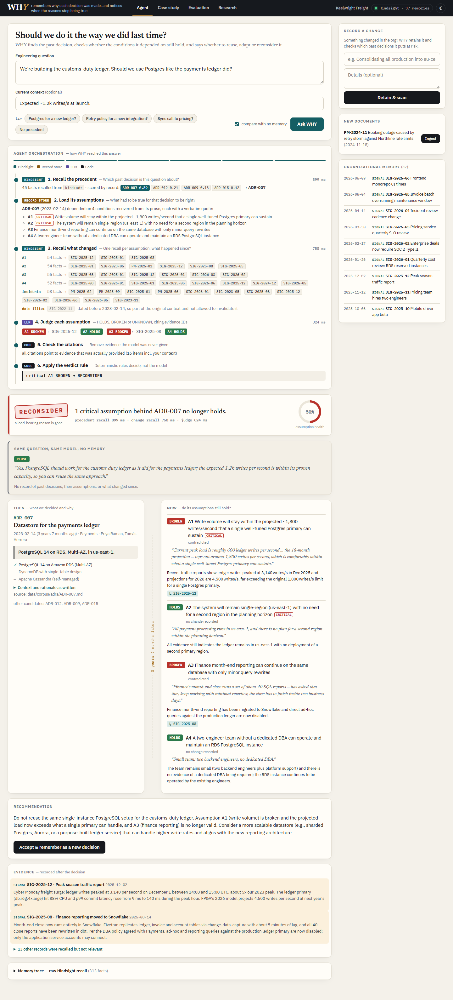
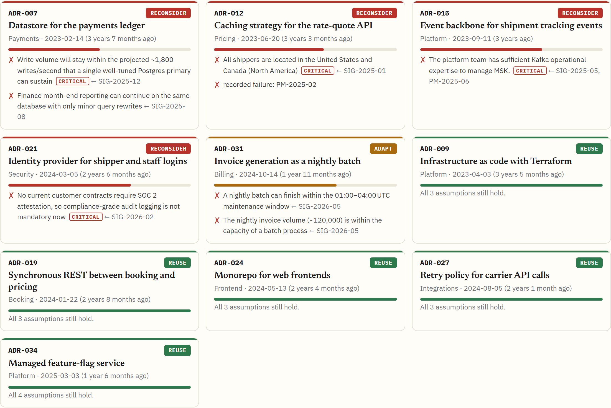

# The ADR said Postgres. Hindsight remembered why that stopped being true

In February 2023 our payments team chose PostgreSQL for the ledger, for two good reasons: finance ran its month-end reports as SQL JOINs directly on that database, and peak writes were projected to stay under about 1,800 per second. By December 2025 both reasons were gone. Finance had moved to Snowflake in August, and Cyber Monday pushed the ledger to 3,140 writes per second. Neither change mentioned the ADR. So when a new team asked "should the customs-duty ledger use Postgres, like payments did?", the honest answer lived in three documents written by three different people over three years, and nobody was going to read all of them.

I built an agent called WHY for exactly that question. It doesn't just remember what we decided. It remembers the conditions each decision depended on, and checks whether they still hold before anyone reuses it.



## What it does

You ask an engineering question. WHY answers with one of four verdicts: **REUSE**, **ADAPT**, **RECONSIDER** or **INSUFFICIENT_EVIDENCE**. It shows the past decision it matched, each assumption that decision relied on (with the sentence from the ADR it came from), what has changed since, and which rule produced the verdict.

It also runs the other way. Record a change, for example "we're consolidating production into eu-central-1", and WHY checks every past decision's assumptions and warns you about the ones that change breaks.

The memory layer is [Hindsight](https://github.com/vectorize-io/hindsight). ADRs, postmortems and change notes are all retained there. Everything that decides *what is relevant* goes through Hindsight recall; a small SQLite store only turns a recalled record ID back into the full document.

## The core idea: assumptions are the retrieval keys

My first version did the obvious thing: recall memories similar to the question, hand them to the model, ask for a verdict. It found ADR-007 every time. It almost never found the Snowflake migration, because a note about month-end reporting isn't similar to a question about choosing a database.

What *is* similar to both is the assumption in between: "finance reporting runs SQL JOINs directly on the ledger database." So WHY recalls in two steps. First it finds the precedent decision. Then it loads the assumptions that decision depended on, and recalls once per assumption, restricted to change notes and postmortems.

```python
# src/reasoning.py: stage 2, one Hindsight recall per assumption
queries = [f"{a.statement}. ({rec.title})" for a in assumptions]
results = await asyncio.gather(*(
    memory.recall(q, ["signal", "postmortem"], stage=f"change:{i}", bank_id=self.bank)
    for i, q in enumerate(queries)))
```

Where do the assumptions come from? Real ADRs don't list them; they're buried in the Context section. WHY extracts them with an LLM at ingest time and keeps one only if its supporting quote appears **verbatim** in the source. The model is allowed to elide with "...", but every fragment has to match. I learned the hard way that this check needs to normalize typography: my first run dropped the two most important assumptions because the model wrote "month‑end" with a non-breaking hyphen.

## Time is a first-class field, not metadata

A fact is only evidence against a decision if it happened *after* the decision. Something written in 2022 was part of the world the 2023 decision was made in, so it can't invalidate it. That one line is what makes the system temporal.

Hindsight makes this easy because `retain` takes a timestamp. Every record goes in with its real historical date, its ID as `document_id`, and a kind tag so recall can be scoped:

```python
# src/memory.py
await client().aretain(
    bank_id=bank_id, content=_content(rec, raw_text),
    timestamp=datetime.combine(rec.date, time(12, 0)),   # when it happened, not when we ingested it
    context=CONTEXT[rec.kind], document_id=rec.id,
    tags=[f"kind:{rec.kind}"],
    metadata={"record_id": rec.id, "kind": rec.kind, "date": rec.date.isoformat()},
)
```

One trap: Hindsight's extracted facts carry their own occurrence ranges, and a date like 2024-03-12 can come back as "March 2024". For the admissibility check I compare against the canonical record's date, not the fact's.

## The model judges; code decides

I don't let the LLM pick the verdict. It makes one narrow judgment: for each assumption, is it HOLDS, BROKEN or UNKNOWN, and which evidence IDs show that? Then code takes over. It removes any cited ID that was never provided, downgrades a BROKEN claim that has no valid citation left, and applies fixed rules:

```python
# src/rules.py
if precedent_failed or any(c.critical and c.status == Status.BROKEN for c in checks):
    return Verdict.RECONSIDER
if not evaluation_complete or any((not c.critical and c.status == Status.BROKEN)
                                  or (c.critical and c.status == Status.UNKNOWN) for c in checks):
    return Verdict.ADAPT
return Verdict.REUSE
```

Because the rules are plain code, I can test properties instead of hoping for them. One test walks every combination of assumption states and checks that adding contradicting evidence never makes WHY *more* willing to reuse a decision. Another caught a real bug: when the model call failed and every assumption was non-critical, the old rules returned REUSE. A failed evaluation now can never produce REUSE.

The UI shows all of this live: which step is Hindsight, which is the model, which is code, what each recall found, which citations were cut, and the exact rule that fired, e.g. `critical A1 BROKEN → RECONSIDER`.

## What happens in practice

Same question, same model, with and without memory:

> **Without memory:** "Yes, PostgreSQL should work for the customs-duty ledger as it did for the payments ledger; the expected 1.2k writes per second is within its proven capacity, so you can reuse the same approach." → REUSE
>
> **With WHY:** ADR-007, decided 3 years 7 months ago. A1 *write volume stays near 1,800/s*: BROKEN, peak hit 3,140/s (Dec 2025). A3 *finance reporting runs on the same database*: BROKEN, moved to Snowflake (Aug 2025). A2 *single region*: HOLDS, the EU launch kept the ledger in us-east-1. → RECONSIDER

The learning loop is the part I like most. Ask whether a new integration should reuse our carrier retry policy (5 retries, exponential backoff) and WHY says REUSE, because nothing in memory contradicts it. Ingest the postmortem of a 47-minute outage caused by a retry storm against a carrier's rate limit, ask the identical question, and the answer becomes RECONSIDER, citing the postmortem. Same question, different answer, because memory changed.



I also ran it across a whole decision log. For the fictional company in the demo, Keelwright Freight, WHY flagged 5 of 10 active decisions as no longer resting on the conditions they were made under.

## Does it hold up on decisions I didn't write?

That was the question that bothered me most, since I wrote the demo company's records myself. So I ran WHY on the 38 architecture decision records GOV.UK published between 2017 and 2022 in [alphagov/govuk-aws](https://github.com/alphagov/govuk-aws). Each decision is evaluated using only records dated after it. The ground truth is GOV.UK's own history: which decisions it later superseded or reversed. I stripped the "superseded by" notes that were added to old records afterwards, so the answer couldn't leak.

- The extractor recovered **109 grounded assumptions** from 38 real ADRs; only **3** were dropped for not being verbatim.
- WHY flagged **3 of 3** decisions GOV.UK later changed, each time **citing the record that changed it**. Hindsight's built-in `reflect` also flagged all three but named the changing record in only 1 of 3.
- One of those was never linked in the record at all: a 2017 decision to point Content Store at the shared Mongo cluster, implicitly reversed by a 2019 decision to move Mongo apps, Content Store included, to DocumentDB.
- It left **4 of 5** decisions GOV.UK never revisited alone.

Eight cases is a pilot, not a proof, but the decisions were written by other engineers and history is the answer key.

On a 26-question controlled benchmark over the demo company, the same model with no memory reused a stale decision in **4 of 16** cases where it shouldn't have. WHY, on the same model, reused **none** and got **21 of 26** verdicts right, against 8 of 26 without memory and 13 of 26 when the model was simply handed recalled memories (p = 0.002 and 0.04). Hindsight's own `reflect` scored 17 of 26, behind WHY but not significantly at this size, and it got none of the three before/after flips right. WHY's weak spot is the mirror image: 1 of 7 times it cried wolf.

Performance: a question takes a median of **3.4 seconds** end to end, with 1 LLM call, about 2,350 tokens and 5–6 Hindsight recalls. Recall itself is around 450 ms and scaled from 1.3 to 10 recalls per second as I raised concurrency from 1 to 8. On a free LLM tier the request-rate limit is the bottleneck, not memory. That's also why the tripwire judges all candidate decisions in one LLM call instead of one call each.

## What I learned

1. **Store the conditions, not just the decision.** The decision text is what everyone retrieves. The assumptions are what change.
2. **Dates are part of the evidence.** Filtering to "recorded after the decision" removed a whole class of wrong answers, and it only works because Hindsight retains real timestamps.
3. **Let code have the last word.** A narrow LLM judgment plus deterministic rules gave me behavior I could test and explain, and a place to catch invented citations.
4. **Measure the behavior, not the retrieval.** My evaluation asks whether the verdict changes correctly: false reuse, flips after new evidence, questions that assume the old answer ("like payments did, right?").
5. **Report the result that surprised you.** My ablation with a single question-keyed recall scored as well as the two-stage version on this corpus (22 vs 21 of 26). With 37 records, one recall already finds most of what matters. The value I can defend is the decision layer on top of memory, not a cleverer retriever.

## Limitations

The extractor finds the right premises but sometimes rates a minor one as critical, which turns an ADAPT into a RECONSIDER. It is the main source of wrong verdicts. And if a change was never written down anywhere, WHY can't know about it: it labels those assumptions "no change recorded", never "confirmed", so the gap is at least visible.

## Links

- [Hindsight on GitHub](https://github.com/vectorize-io/hindsight), the agent memory layer used here
- [Hindsight documentation](https://hindsight.vectorize.io/) for retain, recall and reflect
- [What is agent memory?](https://vectorize.io/what-is-agent-memory) from Vectorize
- WHY source code: https://github.com/aryan-nampally/WHY-decision_agent
